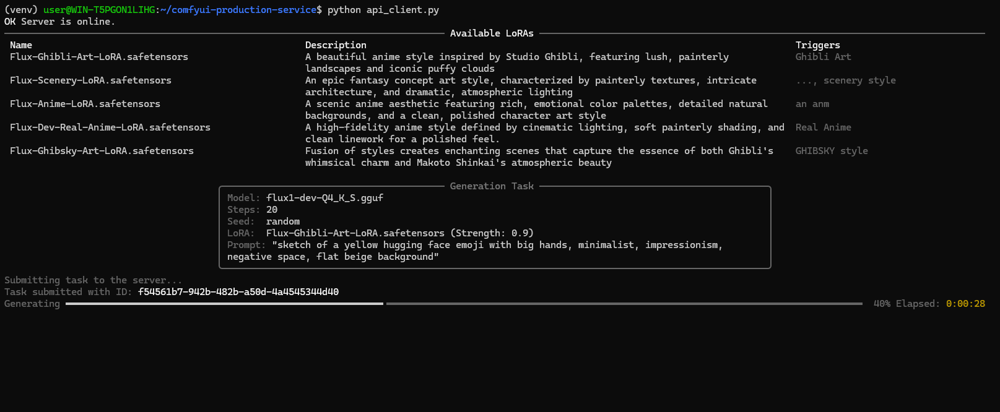

# ComfyUI Production Service

Welcome to the ComfyUI Production Service! This project provides a robust, scalable, and production-ready API wrapper around ComfyUI, designed for high-throughput image generation. It leverages a powerful asynchronous task queue system to manage jobs, allowing you to scale your service across multiple GPUs and machines with ease.

The core philosophy is **configuration over code**. Most of the API's behavior, including available models, LoRAs, and workflow parameters, is defined in simple YAML and INI files, making it easy to manage and update without touching the Python source.

## ✨ Key Features

*   **🚀 Scalable Architecture:** Built with Celery and Redis, allowing you to distribute generation tasks across multiple worker processes, on one or many machines, each utilizing a separate GPU.
*   **⚡ Asynchronous by Design:** The API immediately accepts tasks and returns a `task_id`. Clients can poll for status and results, preventing blocked connections and enabling a responsive user experience.
*   **📝 Manifest-Driven Configuration:**
    *   Define API parameters in `base.yaml`.
    *   Expose workflows and their specific parameters in `workflows.yaml`.
    *   Manage LoRAs, including automatic prompt modifications (prefixes/suffixes), in `loras.yaml`.
*   **🧩 LoRA-Aware Prompting:** Automatically adds trigger words or style modifiers to your prompt when a specific LoRA is selected, as defined in `loras.yaml`.
*   **📦 Automated Setup:** A comprehensive `install.sh` script handles everything from setting up a virtual environment to installing custom nodes and downloading models.
*   **🤖 Rich & Minimal Clients:** Comes with two pre-built Python clients:
    *   A feature-rich client with beautiful terminal output (progress bars, tables).
    *   A minimal, dependency-free client perfect for scripting and CI/CD.
*   **🌐 Flexible Model Management:** Easily specify which models to download from Hugging Face using a simple `models.ini` configuration file.

## 🏛️ Architecture

The service is composed of several key components that work together to process image generation requests efficiently.

Of course. Here is a more dynamic, multi-directional text-based diagram that illustrates the flow of data moving right, down, left, and up, creating a clear processing loop.

---

```text
+------------------+
|   User / Client  |
+------------------+
         |
         | (1) POST /generate
         v
+------------------------+      (2) Enqueue Task       +-------------------------+
|  API Server (FastAPI)  | --------------------------> |  Redis (Broker/Backend) |
+------------------------+                             +-------------------------+
         ^                                                         |
         |                                                         | (3) Worker picks
         | (6) Client polls for result                             |     up task
         |     via GET /tasks/{id}                                 v
         |                                               +-------------------------+
         |                                               |  Celery Worker (Pool)   |
         |                                               +-------------------------+
         |                                                         |
         |      (5) Worker writes result back to Redis             | (4) Worker runs
         |                                                         |     generation
         +---------------------------------------------------------+
                                                                   |
                                                                   v
                                                       +-------------------------+
                                                       |  Compute (ComfyUI/GPU)  |
                                                       +-------------------------+
```

### The Generation & Retrieval Lifecycle

The service operates on a non-blocking, asynchronous model. The process of creating an image is separate from the process of retrieving it. This ensures the API remains responsive and can handle a high volume of concurrent requests.

#### Part 1: The Generation Flow (Steps 1-5)

This is the "fire-and-forget" part of the process, where the client submits a job and the system gets to work.

1.  **Request Ingestion**
    The process begins when a client sends a `POST` request to the `/generate` endpoint. This request contains the `workflow_id` to use and a `params` object with all the generation details (e.g., prompt, model, steps, seed).

2.  **Task Creation & Queuing**
    The API Server receives the request. It does not start generating the image itself. Instead, it:
    *   Validates the incoming parameters against the manifests (`base.yaml`, `workflows.yaml`).
    *   Creates a new job and pushes it into the **Redis Task Queue**.
    *   Immediately responds to the client with a JSON object containing a unique `task_id`. This entire step is extremely fast, typically taking only milliseconds.

3.  **Task Distribution**
    The task now sits in the Redis queue, waiting to be processed. A pool of **Celery Workers** is constantly listening to this queue. As soon as a worker is free, it picks up the next available task.
    > *This is the core of the system's scalability. You can run many workers across multiple GPUs or even multiple machines, and they will all pull tasks from this central queue, effectively distributing the workload.*

4.  **The Heavy Lifting: Generation**
    The worker that picked up the task is now responsible for execution. It performs the most resource-intensive part of the process:
    *   It launches and manages a dedicated **ComfyUI instance**.
    *   It populates the ComfyUI workflow with the parameters from the task.
    *   It utilizes a **dedicated GPU** to render the image.
    *   During this time, it can update the task's status in Redis to `PROGRESS`, providing real-time feedback on the generation steps.

5.  **Storing the Result**
    Once the image has been successfully generated and saved to disk, the worker's job is almost done. It:
    *   Takes the file path of the final image.
    *   Writes this path back to the **Redis Result Backend**, associating it with the original `task_id`.
    *   Marks the task's final status as `SUCCESS`. The task is now complete and the result is safely stored.

---

#### Part 2: The Result Retrieval Flow

This is a separate, asynchronous process initiated by the client after it has received a `task_id`.

6.  **Polling for Status and Downloading**
    The client uses the `task_id` to periodically send `GET` requests to the `/tasks/{task_id}` endpoint. The API server handles these requests by checking Redis:
    *   **If the task is `PENDING` or `PROGRESS`**, the server reports this status, and the client knows to wait and try again after a short delay.
    *   **If the task is `FAILURE`**, the server returns the error details stored in the result.
    *   **If the task is `SUCCESS`**, the server retrieves the stored file path, constructs a full, public-facing download URL (using the `PUBLIC_IP` from the `.env` configuration), and returns it to the client. The client can then use this URL to download the final image directly.

comfyui-api## 🛠️ Technology Stack

*   **Backend Framework:** [FastAPI](https://fastapi.tiangolo.com/)
*   **Task Queue:** [Celery](https://docs.celeryq.dev/en/stable/)
*   **Message Broker / Result Backend:** [Redis](https://redis.io/)
*   **Core Generation Engine:** [ComfyUI](https://github.com/comfyanonymous/ComfyUI)
*   **Containerization:** [Docker](https://www.docker.com/)

---

## ⚙️ Installation

Follow these steps to set up the entire environment.

### Prerequisites

*   **Git:** To clone the repository.
*   **Python 3.10+:** To run the service and installer.
*   **Docker:** The easiest way to run the required Redis instance.

### Step 1: Clone the Repository

```bash
git clone https://github.com/FaraamFide/comfyui-api.git
cd comfyui-api
```

### Step 2: Configure Environment

The service uses a `.env` file for configuration. A template is provided.

1.  **Copy the example file:**
    ```bash
    cp .env.example .env
    ```

2.  **Edit `.env`:**
    ```dotenv
    # .env

    # --- FastAPI & Network Settings ---
    UVICORN_HOST="0.0.0.0"
    UVICORN_PORT="8000"
    PUBLIC_IP="http://127.0.0.1:8000" # IMPORTANT: Must be a full URL

    # --- Celery & Redis Settings ---
    REDIS_HOST="localhost"
    REDIS_PORT="6379"
    REDIS_PASSWORD="redis"
    REDIS_DB="0"

    # --- Hugging Face Token ---
    # Get your token here: https://huggingface.co/settings/tokens
    HUGGINGFACE_TOKEN="hf_YOUR_TOKEN_HERE"

    # ... other settings ...
    ```
    *   **`PUBLIC_IP`**: This is crucial. It's the base URL that will be used to generate download links for the final images. For local testing, `http://127.0.0.1:8000` is correct.
    *   **`HUGGINGFACE_TOKEN`**: Add your Hugging Face token to download models, especially private ones, and to avoid being rate-limited.

### Step 3: Run the Installer

The `install.sh` script automates the entire setup process.

```bash
bash install/install.sh
```

This script will:
1.  Check for dependencies (Git, Python).
2.  Create a Python virtual environment in `./venv`.
3.  Install all required Python packages from `install/requirements.lock.txt`.
4.  Clone the ComfyUI repository into `./ComfyUI`.
5.  Install all custom nodes listed in `install/configs/custom_nodes.txt`.
6.  Download all models specified in `install/configs/models.ini`.

---

## ▶️ Running the Service

After installation, you need to run three components in separate terminal windows.

**First, activate the virtual environment in all terminals:**
```bash
source venv/bin/activate
```

### Terminal 1: Start Redis

Use the provided Docker command to start a Redis Stack instance with the correct password.

```bash
docker run -d -p 127.0.0.1:6379:6379 --name comfy-redis -e REDIS_ARGS="--requirepass redis" redis/redis-stack:latest
```

P.S: Useful command while testing
```bash
docker stop comfy-redis && docker rm comfy-redis && docker run -d -p 127.0.0.1:6379:6379 --name comfy-redis -e REDIS_ARGS="--requirepass redis" redis/r
edis-stack:latest
```

### Terminal 2: Start the Celery Worker(s)

Start a Celery worker to process jobs from the queue.

```bash
# For a single GPU/worker
celery -A src.celery_app.celery_app worker --loglevel=info -c 1
```

*   **`-A src.celery_app.celery_app`**: Points to the Celery application instance.
*   **`--loglevel=info`**: Sets the logging level.
*   **`-c 1`**: **Concurrency**. This is important. It tells this worker process to only handle **one task at a time**, which is what you want when a task fully occupies a GPU.

**To scale across multiple GPUs on the same machine**, open a new terminal for each GPU, activate the venv, and run the worker command with a unique name:
```bash
# Worker for GPU 0
CUDA_VISIBLE_DEVICES=0 celery -A src.celery_app.celery_app worker --loglevel=info -c 1 -n worker1@%h

# Worker for GPU 1 (in a new terminal)
CUDA_VISIBLE_DEVICES=1 celery -A src.celery_app.celery_app worker --loglevel=info -c 1 -n worker2@%h
```

### Terminal 3: Start the FastAPI Server

Finally, start the API server.

```bash
python -m src.main
```

You should see output from Uvicorn indicating the server is running. Your service is now live and ready to accept requests!

---

## 🔧 Configuration Deep Dive

This service is highly configurable through text files located in `src/manifests/` and `install/configs/`.

### Model and Node Configuration

*   **`install/configs/models.ini`**: Defines the models to be downloaded.
    *   Sections like `[unet]` or `[loras]` map directly to subfolders in `ComfyUI/models/`.
    *   **To save with the original filename:** Use `_` as the key.
    *   **To save with a custom filename:** Use your desired name as the key (the extension is preserved).

    ```ini
    [loras]
    # Saves as "Flux-Ghibli-Art.safetensors"
    Flux-Ghibli-Art = https://huggingface.co/strangerzonehf/Flux-Ghibli-Art-LoRA/resolve/main/Ghibli-Art.safetensors

    [clip]
    # Saves as "clip_l.safetensors" (original name is model.safetensors)
    clip_l = https://huggingface.co/black-forest-labs/FLUX.1-dev/resolve/main/text_encoder/model.safetensors
    ```

*   **`install/configs/custom_nodes.txt`**: A simple list of Git repository URLs for the custom ComfyUI nodes you want to install.

### The Manifest System

The manifest files in `src/manifests/` define the public-facing API.

*   **`base.yaml`**: The master dictionary of all possible parameters your API can accept. It defines their type, default value, and how they map to nodes in the ComfyUI workflow.

*   **`workflows.yaml`**: Defines the actual API endpoints (workflows). Each entry specifies which parameters from `base.yaml` it uses and allows for overriding properties (e.g., making a parameter required).

*   **`loras.yaml`**: This file is for LoRA-specific metadata. Its most powerful feature is automatic prompt modification.
    *   **`prefix`**: Text to be added to the beginning of the prompt.
    *   **`suffix`**: Text to be added to the end of the prompt.

    **Example:**
    If `loras.yaml` contains:
    ```yaml
    "Flux-Ghibli-Art-LoRA.safetensors":
      prefix: "Ghibli Art"
      description: "A beautiful anime style..."
    ```
    And a user sends a request with `lora: "Flux-Ghibli-Art-LoRA.safetensors"` and `prompt: "a cat sitting on a fence"`, the service will automatically modify the prompt sent to ComfyUI to be: `"Ghibli Art, a cat sitting on a fence"`.

---

## 🤖 API Usage & Clients

The project includes two Python clients to interact with the API.

### `api_client.py` (Rich Client)

This client provides a rich, user-friendly command-line experience using the `rich` library. It displays available LoRAs in a table, shows task details in a panel, and has a real-time progress bar.

**Usage:**
```bash
python api_client.py
```

**Output Example:**



### `api_client_minimal.py` (Minimal Client)

This is a lightweight, dependency-free client (only uses `requests`). Perfect for integration into other scripts, automated workflows, or CI/CD pipelines where you want simple, predictable output.

---

## 📂 Project Structure

```
.
├── .env
├── .env.example
├── api_client.py
├── api_client_minimal.py
├── install
│   ├── configs
│   │   ├── custom_nodes.txt      # List of custom nodes to install
│   │   └── models.ini            # List of models to download
│   ├── install.sh                # Main installation script
│   ├── requirements.lock.txt     # Pinned Python dependencies
│   └── scripts
│       ├── install_custom_nodes.py
│       └── install_models.py
└── src
    ├── __init__.py
    ├── api.py                    # FastAPI application, defines endpoints
    ├── celery_app.py             # Celery application setup
    ├── config.py                 # Configuration loader (reads .env)
    ├── main.py                   # Main entry point to start the server
    ├── manifest_loader.py        # Logic for loading and validating manifests
    ├── manifests
    │   ├── base.yaml             # Defines all possible API parameters
    │   ├── loras.yaml            # Defines LoRA metadata and prompt mods
    │   └── workflows.yaml        # Defines API workflows
    ├── worker.py                 # Celery task definition and ComfyUI execution logic
    ├── workflow_utils.py         # Helper to populate ComfyUI workflows
    └── workflows
        └── flux_default.json     # The ComfyUI workflow template in JSON format
```
